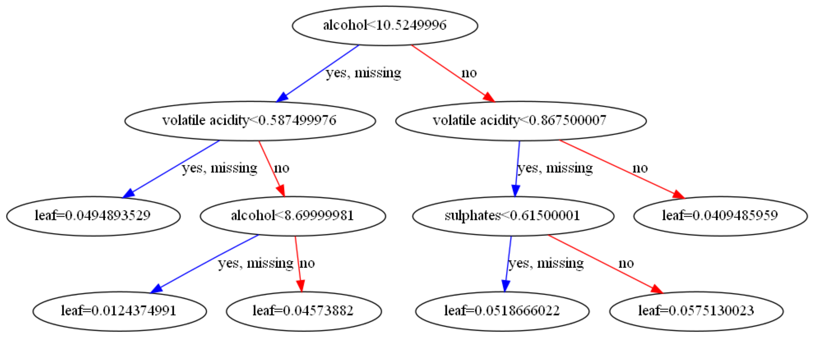

## XGBoost

### 原理简述

XGBoost（eXtreme Gradient Boosting）极致梯度提升，是一种基于GBDT的算法。XGBoost由陈天奇等人在2016年的论文《XGBoost: A Scalable Tree Boosting System》中正式提出，由于具有高效、灵活和轻便的特点，被广泛应用在数据挖掘、推荐系统等领域。XGBoost是由GBDT发展而来，同样是利用加法模型与前向分布算法实现学习的优化过程，但与GBDT依旧存在区别。
其基本思想与GBDT相同，但做了一些优化，比如利用二阶泰勒公式展开来优化损失函数；利用正则项简化模型，规避树过拟合；利用Block存储结构实现并行计算等。

区别主要包括以下几点：

·目标函数：XGBoost的损失函数添加了正则化项，使用正则用以控制模型的复杂度，正则项里包含了树的叶子节点个数、每个叶子节点权重（叶节点的score值）平方和。

·优化方法：GBDT在优化时只使用了一阶导数信息，XGBoost在优化时使用了一、二介导数信息。

·缺失值处理：XBGoost对缺失值进行了处理，通过学习模型自动选择最优的缺失值默认切分方向。

·防止过拟合：XGBoost除了增加正则项来防止过拟合，还支持行列采样的方式来防止过拟合。

·结果：可以在最短时间内用更少的计算资源得到更好的结果

XGBoost被大量运用于竞赛中，比如Kaggle竞赛。

### 实验代码

首先导入需要的扩展包


```python
import os
import pandas as pd
import csv
from sklearn.model_selection import train_test_split
from xgboost import XGBRegressor
import math
import numpy as np
from sklearn.metrics import accuracy_score
```

读取经过预处理划分后的训练数据、测试数据与训练标签、测试标签。并打印出训练数据的数据类别。


```python
train_data_path = r'D:\研一下学期\数据挖掘\Red Wine Quality\preprocessing_data\data_train.csv'
test_data_path = r'D:\研一下学期\数据挖掘\Red Wine Quality\preprocessing_data\data_test.csv'
train_label_path = r'D:\研一下学期\数据挖掘\Red Wine Quality\preprocessing_data\target_train.csv'
test_label_path = r'D:\研一下学期\数据挖掘\Red Wine Quality\preprocessing_data\target_test.csv'

tr_data_csv=pd.read_csv(train_data_path)
te_data_csv=pd.read_csv(test_data_path)
tr_label_csv=pd.read_csv(train_label_path)
te_label_csv=pd.read_csv(test_label_path)

print(tr_data_csv.columns)
```

    Index(['fixed acidity', 'volatile acidity', 'citric acid', 'residual sugar',
           'chlorides', 'free sulfur dioxide', 'total sulfur dioxide', 'density',
           'pH', 'sulphates', 'alcohol'],
          dtype='object')
    


```python
X=tr_data_csv[['fixed acidity', 'volatile acidity', 'citric acid', 'residual sugar', 'chlorides', 'free sulfur dioxide', 'total sulfur dioxide', 'density', 'pH', 'sulphates', 'alcohol']]
Y=tr_label_csv['quality']
X_test=te_data_csv[['fixed acidity', 'volatile acidity', 'citric acid', 'residual sugar', 'chlorides', 'free sulfur dioxide', 'total sulfur dioxide', 'density', 'pH', 'sulphates', 'alcohol']]
Y_test=te_label_csv['quality']
```


```python
#xg=XGBRegressor(n_estimators=360,learning_rate=0.05,min_child_weight=2,max_depth=5)#0.685
xg=XGBRegressor(n_estimators=1120,learning_rate=0.01,min_child_weight=1,max_depth=6)
xg.fit(X, Y)
pre_test = xg.predict(X_test)
pre_train = xg.predict(X)
print("accuracy score:" + str(accuracy_score(Y_test, np.round(pre_test))))
```

    accuracy score:0.7025
    

#### 可以看出，利用XGBoost模型进行预测的准确率为70.25%


```python
print(Y_test)
print(np.round(pre_test))
```

    0      6
    1      7
    2      6
    3      7
    4      5
          ..
    395    7
    396    5
    397    5
    398    6
    399    6
    Name: quality, Length: 400, dtype: int64
    [6. 7. 6. 8. 5. 6. 6. 5. 5. 5. 5. 6. 5. 6. 6. 6. 5. 5. 7. 6. 6. 6. 5. 6.
     5. 6. 6. 5. 7. 6. 5. 6. 6. 6. 5. 6. 6. 5. 6. 6. 5. 5. 5. 5. 6. 5. 6. 5.
     6. 5. 6. 5. 5. 5. 6. 6. 6. 5. 5. 5. 5. 7. 6. 5. 5. 6. 6. 5. 5. 5. 5. 6.
     5. 6. 6. 5. 6. 5. 6. 6. 6. 5. 6. 6. 5. 6. 7. 6. 5. 6. 5. 5. 5. 5. 6. 5.
     6. 6. 6. 6. 5. 7. 5. 7. 5. 7. 5. 5. 7. 7. 5. 5. 6. 5. 6. 6. 5. 6. 5. 6.
     6. 6. 6. 6. 5. 5. 5. 4. 6. 5. 6. 5. 5. 6. 6. 7. 5. 6. 5. 7. 5. 7. 6. 5.
     6. 6. 5. 5. 6. 5. 5. 6. 6. 6. 5. 5. 5. 5. 5. 7. 6. 5. 6. 5. 6. 5. 6. 6.
     5. 7. 5. 6. 5. 5. 5. 5. 5. 6. 5. 7. 7. 5. 6. 5. 7. 6. 6. 5. 7. 5. 6. 5.
     6. 5. 5. 5. 4. 5. 5. 6. 6. 5. 6. 6. 6. 5. 5. 6. 6. 5. 6. 6. 6. 5. 7. 6.
     5. 6. 5. 6. 5. 5. 5. 6. 6. 5. 6. 7. 6. 6. 7. 5. 5. 7. 5. 6. 6. 5. 5. 6.
     6. 5. 7. 5. 6. 5. 5. 6. 5. 7. 5. 6. 6. 6. 5. 6. 5. 6. 6. 6. 6. 5. 5. 5.
     6. 5. 5. 7. 5. 7. 6. 5. 6. 5. 5. 5. 6. 5. 6. 5. 6. 5. 5. 6. 5. 6. 5. 5.
     6. 6. 6. 5. 6. 6. 7. 5. 5. 6. 6. 5. 6. 6. 6. 6. 6. 6. 5. 5. 6. 5. 5. 5.
     6. 7. 6. 6. 5. 6. 5. 6. 7. 6. 4. 5. 5. 6. 5. 5. 7. 5. 5. 6. 6. 6. 5. 5.
     5. 5. 5. 5. 6. 5. 5. 6. 5. 7. 5. 6. 6. 5. 5. 6. 6. 5. 6. 7. 5. 5. 7. 6.
     5. 6. 6. 5. 5. 5. 6. 5. 6. 6. 6. 6. 5. 5. 5. 5. 5. 6. 5. 7. 6. 5. 5. 6.
     5. 5. 5. 6. 6. 6. 6. 5. 6. 5. 7. 7. 5. 5. 6. 6.]
    

观察在XGBoost模型训练过程中，各特征对于训练过程的重要性.可以观察到，volatile acitidy属性的重要性最高，free sulfur dioxide属性的重要性最低。


```python
from xgboost import plot_importance
import matplotlib.pyplot as plt

plot_importance(xg)
plt.rcParams['figure.figsize'] = [10, 10]
plt.show()
```


    

    


利用xgboost中自带的plot_tree工具，将训练后模型中的决策树可视化。下列代码将第一棵决策树绘制出来。


```python
import graphviz
from xgboost import plot_tree
plot_tree(xg,num_trees=1)
#设置图形的大小
plt.rcParams['figure.figsize'] = [500, 200]
plt.show()
```


    

    

